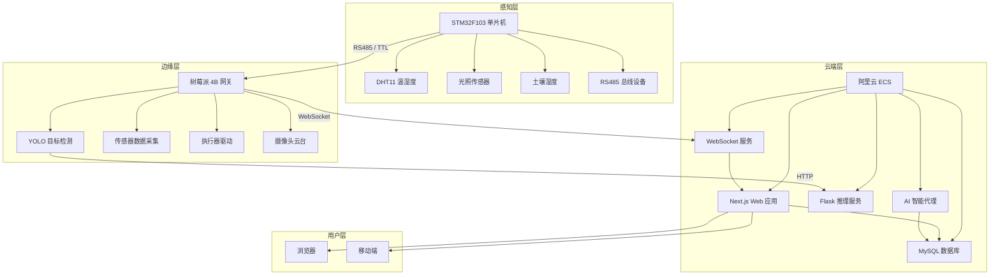

# 🌱 智慧农业物联网平台 (Smart Agriculture IoT Platform)

> 一个覆盖 **STM32 硬件采集 → 树莓派边缘网关 → 云端服务 → Web 前端 → AI 智能代理** 全链路的智慧农业物联网平台，实现环境感知、执行器联动、AI 视觉识别与智能诊断的一体化解决方案。

---

## 📋 目录

- [📖 项目简介](#-项目简介)
- [🏗️ 系统架构](#️-系统架构)
- [📦 子项目说明](#-子项目说明)
- [🚀 快速开始](#-快速开始)
- [💻 环境要求](#-环境要求)
- [☁️ 部署指南](#️-部署指南)
- [📁 项目结构](#-项目结构)
- [🔧 技术栈](#-技术栈)
- [📝 贡献指南](#-贡献指南)
- [📄 许可证](#-许可证)

---

## 📖 项目简介

**天工慧眼 · 智慧农业物联网平台** 是一个面向现代农业场景的全栈物联网系统，通过"端-边-云"三层架构实现农业环境的实时监测与智能控制：

- **端**：STM32F103 单片机采集温湿度、光照、土壤等环境数据，通过 RS485/TTL 总线与网关通信；驱动 PWM 舵机、继电器等执行器。
- **边**：树莓派 4B 作为边缘网关，运行 YOLO 目标检测模型进行作物识别，采集传感器数据并通过 WebSocket 实时上报云端，同时接收云端控制指令联动本地执行器。
- **云**：Next.js 全栈应用提供 REST API 与 WebSocket 服务，MySQL 持久化存储，PM2 进程管理，部署于阿里云 ECS。
- **智**：AI 智能代理基于 DeepSeek 大语言模型，提供设备诊断、异常告警分析与智能问答能力。

### ✨ 核心功能

| 功能模块 | 说明 |
|---------|------|
| 🌡️ 环境监测 | 温湿度、光照、CO₂、土壤湿度等多维度实时采集与可视化 |
| 🎯 AI 视觉识别 | 基于 YOLOv5/YOLO11 的作物病害检测与生长状态识别 |
| ⚙️ 执行器控制 | 蜂鸣器、风扇、激光、RGB-LED、继电器、摄像头云台联动 |
| 📊 数据看板 | 实时数据流、历史趋势图表、设备状态总览 |
| 🤖 智能诊断 | LLM 驱动的设备故障诊断与运维建议 |
| 📡 设备通信 | WebSocket 双向实时通信，支持多设备并发接入 |
| 🔔 告警系统 | 阈值告警、异常事件推送、告警记录查询 |

---

## 🏗️ 系统架构



### 数据流向

```
传感器 → STM32 → RS485 → 树莓派网关 → WebSocket → 云端服务器 → 数据库
                                                          ↓
摄像头 → YOLO推理 → 检测结果 → WebSocket上报 → 云端存储 → Web前端展示
                                                          ↓
Web前端 ← REST API ← 云端服务器 ← 控制指令 ← 用户操作
                                                          ↓
执行器 ← 树莓派网关 ← WebSocket ← 云端服务器 ← 控制指令
```

---

## 📦 子项目说明

### 1. 🖥️ smart-agriculture — 云端 Web 应用

| 属性 | 说明 |
|------|------|
| **路径** | `smart-agriculture/` |
| **技术栈** | Next.js 16 + React 19 + TypeScript + TailwindCSS + shadcn/ui |
| **数据库** | MySQL 8.0（生产）/ SQLite（开发） |
| **说明** | 平台核心 Web 应用，包含前端界面、REST API、WebSocket 实时通信服务、AI 推理服务 |

**主要功能**：数据看板、设备管理、执行器控制、AI 诊断、知识库、告警管理

---

### 2. 🍓 基于树莓派yolo的传感器检测与上传 — 边缘网关

| 属性 | 说明 |
|------|------|
| **路径** | `基于树莓派yolo的传感器检测与上传/` |
| **技术栈** | Python 3.9+ + YOLOv5/YOLO11 + WebSocket |
| **硬件** | 树莓派 4B + Raspberry Pi OS |
| **说明** | 运行在树莓派上的边缘计算网关，负责传感器数据采集、YOLO 目标检测、执行器控制与云端通信 |

**主要功能**：传感器采集、YOLO 推理、WebSocket 上报、执行器驱动（蜂鸣器/风扇/激光/RGB-LED/继电器）、摄像头云台控制、OTA 升级

---

### 3. 🔌 硬件端 — STM32 嵌入式固件

| 属性 | 说明 |
|------|------|
| **路径** | `硬件端/` |
| **技术栈** | C + STM32F103 + Keil MDK + Makefile |
| **说明** | STM32F103 单片机固件，负责底层传感器数据采集、RS485 通信、PWM 舵机驱动、D4X TTL 通讯 |

**子目录**：
- `stm32-main/` — 主固件项目（Keil MDK）
- `stm32-makefile/` — Makefile 构建版本
- `stm32-wifi/` — WiFi 通信扩展
- `stm32-v3/` — V3 版本迭代

---

### 4. 🤖 bonsai_agent — AI 智能代理

| 属性 | 说明 |
|------|------|
| **路径** | `bonsai_agent/` |
| **技术栈** | Python + DeepSeek API + Web 界面 |
| **说明** | 基于大语言模型的 AI 智能代理，提供设备诊断、日志分析、智能问答等能力 |

**主要功能**：设备故障诊断、传感器数据分析、LLM 工具调用、Web 交互界面

---

### 5. 🎮 device-simulator — 设备模拟器

| 属性 | 说明 |
|------|------|
| **路径** | `device-simulator/` |
| **技术栈** | Python |
| **说明** | 本地开发测试用的设备模拟器，模拟真实传感器数据上报和执行器控制响应，无需硬件即可开发调试 |

**主要功能**：模拟传感器数据生成、WebSocket 连接测试、执行器指令响应模拟、PyInstaller 打包为独立可执行文件

---

### 6. ☁️ 云端部署 — 部署脚本与配置

| 属性 | 说明 |
|------|------|
| **路径** | `云端部署/` |
| **技术栈** | Shell + PM2 + 阿里云 CLI |
| **说明** | 包含生产环境部署所需的全部脚本、配置文件和运维工具 |

**主要内容**：
- `ecosystem.config.js` — PM2 进程管理配置
- `server-init.sh` — 服务器初始化脚本
- `deploy-app.sh` — 应用部署脚本
- `i2c-watchdog.sh` — I2C 看门狗服务
- `setup-events-2.sh` — MySQL 事件调度配置
- 各类诊断与检查脚本

---

## 🚀 快速开始

### 本地开发

#### 1. 克隆项目

```bash
git clone <repository-url>
cd smart-agriculture
```

#### 2. 安装依赖

```bash
# 安装 Node.js 依赖
npm install

# 安装 Python 推理服务依赖（可选）
cd inference-service
pip install -r requirements.txt
```

#### 3. 配置环境变量

```bash
cp .env.example .env.local
```

编辑 `.env.local`，配置数据库和 AI 服务：

```env
# 数据库（本地开发默认 SQLite，无需额外配置）
DATABASE_TYPE=sqlite
SQLITE_DB_PATH=./smart_agriculture.db

# AI 模式（auto / local / network）
AI_MODE=auto
```

#### 4. 初始化数据库

```bash
node scripts/init-db.js
```

#### 5. 启动开发服务器

```bash
# 一键启动（推荐）
npm run dev

# 或使用启动脚本
# Windows
setup.bat
# Linux/macOS
./setup.sh
```

#### 6. 启动设备模拟器（可选）

```bash
cd ../device-simulator
python simulator.py
```

访问 http://localhost:3000 即可看到平台界面。

---

### 云端部署

#### 1. 服务器准备

```bash
# 在阿里云 ECS (Ubuntu 22.04) 上执行初始化
sudo bash server-init.sh
```

#### 2. 部署应用

```bash
# 构建 Next.js 应用
cd smart-agriculture
npm ci
npm run build

# 使用 PM2 启动
pm2 start ecosystem.config.js
pm2 save
```

#### 3. PM2 进程说明

| 进程名 | 端口 | 说明 |
|--------|------|------|
| `smart-agri-web` | 3000 | Next.js Web 应用 |
| `smart-agri-ws` | 8080/8081 | WebSocket 设备通信服务 |

#### 4. 配置树莓派网关

```bash
# 在树莓派上
cd 基于树莓派yolo的传感器检测与上传
pip install -r requirements.txt

# 配置云端服务器地址
# 编辑 config/ 目录下的配置文件

# 启动网关程序
python main.py
```

---

## 💻 环境要求

| 组件 | 要求 | 说明 |
|------|------|------|
| **Node.js** | ≥ 18.x | Next.js 运行时 |
| **Python** | ≥ 3.9 | 推理服务、网关、模拟器 |
| **MySQL** | 8.0+ | 生产环境数据库 |
| **SQLite** | 内置 | 本地开发数据库（无需安装） |
| **树莓派** | 4B+ | 边缘网关硬件 |
| **Raspberry Pi OS** | 64-bit | 网关操作系统 |
| **STM32F103** | - | 嵌入式采集硬件 |
| **Keil MDK** | 5.x | STM32 固件开发 IDE |
| **阿里云 ECS** | 2核2G+ | 生产服务器（最低配置） |
| **Ubuntu** | 22.04 LTS | 服务器操作系统 |
| **PM2** | latest | Node.js 进程管理 |

---

## ☁️ 部署指南

### 生产环境架构

```
阿里云 ECS (cn-chengdu, Ubuntu 22.04)
├── Nginx (反向代理)
├── PM2
│   ├── smart-agri-web  → :3000 (Next.js)
│   └── smart-agri-ws   → :8080/:8801 (WebSocket)
├── MySQL 8.0           → :3306
├── Flask 推理服务      → :5000
└── PM2-logrotate       (日志轮转)
```

### 端口规划

| 端口 | 服务 | 说明 |
|------|------|------|
| 3000 | Next.js Web | 前端页面 + REST API |
| 8080 | WebSocket (设备) | 树莓派网关接入 |
| 8081 | WebSocket (中继) | 前端实时数据推送 |
| 5000 | Flask 推理 | YOLO 模型推理服务 |
| 3306 | MySQL | 数据库 |

### 关键部署脚本

| 脚本 | 用途 |
|------|------|
| `server-init.sh` | 服务器初始化（Node.js、MySQL、PM2 安装） |
| `deploy-app.sh` | 应用部署（构建 + PM2 重启） |
| `install-i2c-watchdog.sh` | I2C 看门狗服务安装 |
| `setup-events-2.sh` | MySQL 定时事件配置 |
| `seed-farm.sh` | 初始农场数据导入 |

### 日志管理

平台采用统一 Logger 模块（TypeScript + Python），配合 PM2-logrotate 实现日志轮转：

```bash
# 查看日志
pm2 logs smart-agri-web
pm2 logs smart-agri-ws

# 日志轮转配置
pm2 install pm2-logrotate
```

---

## 📁 项目结构

```
tghy/
├── smart-agriculture/              # 🖥️ 云端 Web 应用（Next.js 全栈）
│   ├── app/                        #   Next.js App Router 页面与 API
│   ├── components/                 #   React UI 组件
│   ├── lib/                        #   核心业务库（数据库、WebSocket、AI）
│   ├── hooks/                      #   React Hooks
│   ├── inference-service/          #   Python Flask + YOLO 推理服务
│   ├── scripts/                    #   工具脚本（初始化、检查、部署）
│   ├── styles/                     #   全局样式
│   ├── public/                     #   静态资源
│   ├── models/                     #   YOLO 模型文件
│   ├── tools/                      #   辅助工具
│   ├── installer/                  #   安装器
│   ├── websocket-server.js         #   WebSocket 服务器入口
│   ├── package.json                #   Node.js 依赖
│   ├── docker-compose.yml          #   Docker 编排
│   └── Dockerfile                  #   Docker 构建
│
├── 基于树莓派yolo的传感器检测与上传/  # 🍓 树莓派边缘网关
│   ├── main.py                     #   网关主程序入口
│   ├── agent/                      #   网关 Agent 逻辑
│   ├── core/                       #   核心采集与控制模块
│   ├── drivers/                    #   硬件驱动（传感器、执行器）
│   ├── services/                   #   服务层（WebSocket、数据处理）
│   ├── scanner/                    #   YOLO 扫描检测
│   ├── models/                     #   模型文件
│   ├── config/                     #   配置文件
│   ├── ota/                        #   OTA 远程升级
│   ├── ui/                         #   本地 UI
│   ├── tests/                      #   测试
│   └── requirements.txt            #   Python 依赖
│
├── 硬件端/                          # 🔌 STM32 嵌入式固件
│   ├── stm32-main/                 #   主固件（Keil MDK 项目）
│   ├── stm32-makefile/             #   Makefile 构建版本
│   ├── stm32-wifi/                 #   WiFi 通信扩展
│   └── stm32-v3/                   #   V3 版本
│
├── bonsai_agent/                   # 🤖 AI 智能代理
│   ├── main.py                     #   Agent 主程序
│   ├── tools/                      #   LLM 工具集
│   ├── prompts/                    #   提示词模板
│   ├── database/                   #   数据访问层
│   ├── control/                    #   设备控制
│   ├── web/                        #   Web 界面
│   └── requirements.txt            #   Python 依赖
│
├── device-simulator/               # 🎮 设备模拟器
│   ├── simulator.py                #   模拟器主程序
│   ├── requirements.txt            #   Python 依赖
│   └── DeviceSimulator.spec        #   PyInstaller 打包配置
│
├── 云端部署/                        # ☁️ 部署脚本与配置
│   ├── ecosystem.config.js         #   PM2 进程配置
│   ├── server-init.sh              #   服务器初始化
│   ├── deploy-app.sh               #   应用部署
│   ├── i2c-watchdog.sh             #   I2C 看门狗
│   ├── env.production.template     #   生产环境变量模板
│   └── *.sh                        #   各类运维脚本
│
├── database/                       # 🗄️ 数据库文件
│   └── agriculture_iot.db          #   SQLite 数据库
│
├── 参考文件夹/                      # 📚 参考资料
│   ├── RS485通信测试程序/            #   RS485 通信示例
│   └── ATK-D4X TTL通讯/            #   D4X TTL 通讯资料
│
└── README.md                       # 📖 本文件
```

---

## 🔧 技术栈

### 前端

| 技术 | 版本 | 用途 |
|------|------|------|
| Next.js | 16.2.0 | React 全栈框架 |
| React | 19 | UI 库 |
| TypeScript | 5.7 | 类型安全 |
| TailwindCSS | 4.x | 原子化 CSS |
| shadcn/ui | latest | UI 组件库 |
| Recharts | 2.15 | 数据可视化图表 |
| Radix UI | latest | 无障碍基础组件 |

### 后端

| 技术 | 版本 | 用途 |
|------|------|------|
| Next.js API Routes | 16.2.0 | RESTful API |
| WebSocket (ws) | 8.x | 实时双向通信 |
| MySQL | 8.0 | 生产数据库 |
| SQLite | 5.x | 开发数据库 |
| Flask | latest | Python 推理服务 |

### AI & 推理

| 技术 | 版本 | 用途 |
|------|------|------|
| YOLOv5 | latest | 目标检测推理 |
| YOLO11 | latest | 新一代目标检测 |
| DeepSeek API | latest | LLM 智能代理 |
| Ollama | latest | 本地 LLM 推理 |
| FAISS + BGE | latest | RAG 知识检索 |

### 物联网 & 嵌入式

| 技术 | 版本 | 用途 |
|------|------|------|
| STM32F103 | - | 主控单片机 |
| Keil MDK | 5.x | 嵌入式开发 IDE |
| RS485 | - | 工业总线通信 |
| DHT11 | - | 温湿度传感器 |
| PCA9685 | - | PWM 舵机驱动 |
| Raspberry Pi 4B | - | 边缘网关 |
| Python | 3.9+ | 网关程序 |

### 运维 & 部署

| 技术 | 版本 | 用途 |
|------|------|------|
| 阿里云 ECS | - | 云服务器 |
| Ubuntu | 22.04 LTS | 服务器 OS |
| PM2 | latest | Node.js 进程管理 |
| PM2-logrotate | latest | 日志轮转 |
| Docker | latest | 容器化部署（可选） |
| Nginx | latest | 反向代理 |

---

## 📝 贡献指南

欢迎贡献代码！请遵循以下流程：

### 1. Fork 项目

在 GitHub 上 Fork 本仓库到你的账号下。

### 2. 创建特性分支

```bash
git checkout -b feature/amazing-feature
```

### 3. 提交更改

```bash
git commit -m "feat: add amazing feature"
```

**Commit 规范**：
- `feat:` 新功能
- `fix:` 修复 Bug
- `docs:` 文档更新
- `style:` 代码格式（不影响逻辑）
- `refactor:` 重构
- `test:` 测试相关
- `chore:` 构建/工具链相关

### 4. 推送分支

```bash
git push origin feature/amazing-feature
```

### 5. 创建 Pull Request

在 GitHub 上创建 PR，描述你的更改内容和动机。

### 开发注意事项

- 🌿 **分支策略**：`main` 为稳定分支，开发请在 `feature/*` 或 `dev/*` 分支进行
- 🔒 **敏感信息**：请勿在代码或配置中硬编码服务器 IP、密码、API Key 等敏感信息，使用 `.env` 文件管理
- 📝 **代码风格**：前端遵循 ESLint 配置，Python 遵循 PEP 8
- 🧪 **测试**：提交前确保本地测试通过

---

## 📄 许可证

本项目基于 [MIT License](LICENSE) 开源发布。

```
MIT License

Copyright (c) 2024-2026 天工慧眼

Permission is hereby granted, free of charge, to any person obtaining a copy
of this software and associated documentation files (the "Software"), to deal
in the Software without restriction, including without limitation the rights
to use, copy, modify, merge, publish, distribute, sublicense, and/or sell
copies of the Software, and to permit persons to whom the Software is
furnished to do so, subject to the following conditions:

The above copyright notice and this permission notice shall be included in all
copies or substantial portions of the Software.

THE SOFTWARE IS PROVIDED "AS IS", WITHOUT WARRANTY OF ANY KIND, EXPRESS OR
IMPLIED, INCLUDING BUT NOT LIMITED TO THE WARRANTIES OF MERCHANTABILITY,
FITNESS FOR A PARTICULAR PURPOSE AND NONINFRINGEMENT. IN NO EVENT SHALL THE
AUTHORS OR COPYRIGHT HOLDERS BE LIABLE FOR ANY CLAIM, DAMAGES OR OTHER
LIABILITY, WHETHER IN AN ACTION OF CONTRACT, TORT OR OTHERWISE, ARISING FROM,
OUT OF OR IN CONNECTION WITH THE SOFTWARE OR THE USE OR OTHER DEALINGS IN THE
SOFTWARE.
```

---

## 🙏 致谢

感谢所有为智慧农业物联网做出贡献的开发者们！

---

<p align="center">
  <strong>天工慧眼 · 让农业更智慧 🌾</strong>
</p>
