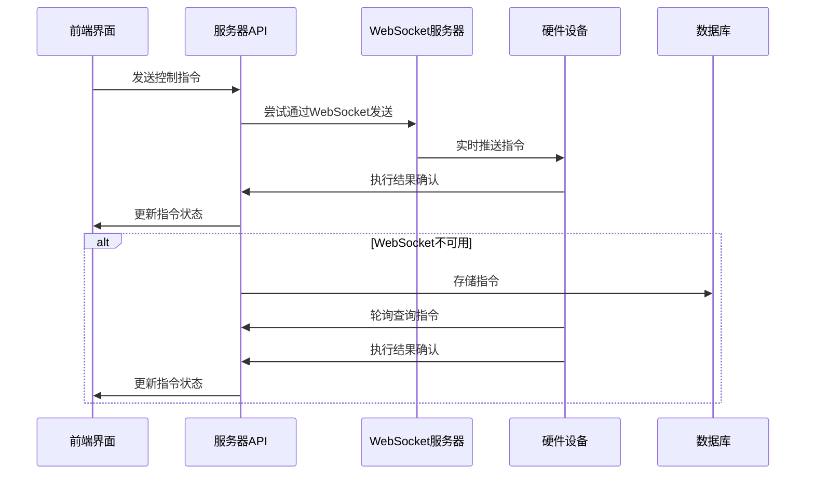
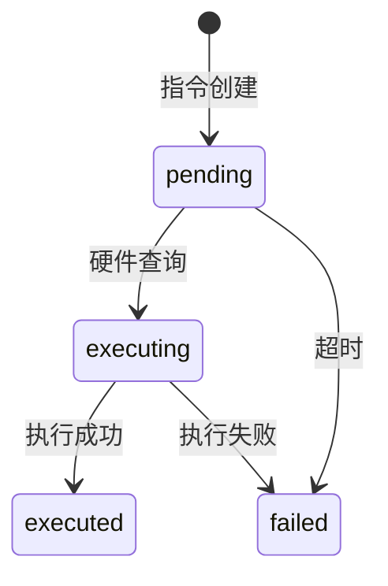

# 智慧农业物联网系统架构与实现文档

## 1. 系统架构概述

### 1.1 整体架构

本系统采用分层架构设计，包含以下主要组件：

- **硬件端**：基于STM32F103C8T6微控制器的嵌入式设备，负责数据采集和执行器控制
- **服务器端**：基于Next.js的Web服务器，提供API接口和WebSocket实时通信
- **前端**：React-based的Web界面，用于数据可视化和设备控制

### 1.2 通信流程



## 2. 硬件端实现

### 2.1 硬件架构

- **微控制器**：STM32F103C8T6
- **通信模块**：ATK-MB026 WiFi模块
- **传感器**：温度、湿度、光照、土壤参数传感器
- **执行器**：水泵、风扇、加热器、电磁阀、补光灯

### 2.2 软件架构

#### 2.2.1 模块结构

```
hardware-optimized/
├── App/
│   ├── Inc/          # 应用头文件
│   └── Src/          # 应用源文件
├── BSP/             # 板级支持包
├── Config/          # 系统配置
├── Middlewares/      # 中间件
│   ├── Protocol/     # 通信协议
│   └── WiFi/         # WiFi管理
├── Makefile          # 构建脚本
└── STM32F103C8T6.ld # 链接脚本
```

#### 2.2.2 核心模块

1. **协议模块** (`protocol.c/h`)
   - 实现二进制通信协议
   - 支持传感器数据、控制命令、心跳等消息类型
   - 包含CRC16校验

2. **命令管理模块** (`command_manager.c/h`)
   - 处理服务器下发的控制指令
   - 实现指令去重和状态管理
   - 发送执行结果确认

3. **状态管理模块** (`state_manager.c/h`)
   - 管理执行器状态
   - 处理异常情况
   - 维护错误历史记录

4. **WiFi管理模块** (`wifi_manager.c/h`)
   - 处理WiFi连接和重连
   - 管理TCP连接
   - 实现数据发送和接收

### 2.3 通信协议

#### 2.3.1 帧结构

| 字段 | 长度 | 描述 |
|------|------|------|
| 帧头 | 1字节 | 0xAA |
| 消息类型 | 1字节 | 0x01-0x05 |
| 设备ID | 8字节 | 设备唯一标识 |
| 时间戳 | 4字节 | 系统 tick |
| 数据 | 可变 | 具体消息数据 |
| CRC16 | 2字节 | 校验和 |
| 帧尾 | 1字节 | 0x55 |

#### 2.3.2 消息类型

- 0x01: 心跳消息
- 0x02: 传感器数据
- 0x03: 控制命令
- 0x04: 命令确认
- 0x05: 连接消息

## 3. 服务器端实现

### 3.1 架构设计

- **API服务器**：Next.js API路由
- **WebSocket服务器**：基于ws库的实时通信
- **数据库**：MySQL/PostgreSQL

### 3.2 核心API

#### 3.2.1 命令管理API

- `GET /api/actuators/[id]/commands` - 硬件端查询指令
- `POST /api/actuators/[id]/commands` - 前端发送指令
- `PATCH /api/actuators/[id]/commands` - 硬件端确认执行结果

#### 3.2.2 WebSocket API

- 连接地址：`ws://localhost:8080?actuator_id=[id]`
- 消息类型：
  - `command` - 控制命令
  - `command_ack` - 命令执行确认
  - `heartbeat` - 心跳消息
  - `heartbeat_ack` - 心跳响应

### 3.3 指令状态流转



## 4. 测试与验证

### 4.1 测试环境

- **硬件**：STM32F103C8T6开发板 + ATK-MB026 WiFi模块
- **服务器**：本地开发服务器
- **网络**：局域网环境

### 4.2 测试用例

#### 4.2.1 基本功能测试

1. **指令发送与执行**
   - 前端发送开启/关闭指令
   - 硬件端接收并执行
   - 服务器确认执行结果

2. **WebSocket通信**
   - 硬件端建立WebSocket连接
   - 服务器实时推送指令
   - 硬件端实时响应

3. **轮询机制**
   - 模拟WebSocket不可用场景
   - 硬件端通过轮询获取指令
   - 验证指令执行流程

4. **指令去重**
   - 服务器重复发送同一指令
   - 硬件端检测并跳过重复指令

5. **错误处理**
   - 模拟硬件执行失败
   - 服务器记录错误状态
   - 前端显示错误信息

### 4.3 测试结果

| 测试项 | 预期结果 | 实际结果 | 状态 |
|--------|----------|----------|------|
| 指令发送与执行 | 指令成功执行并确认 | ✓ | 通过 |
| WebSocket通信 | 实时接收和执行指令 | ✓ | 通过 |
| 轮询机制 | 正常获取和执行指令 | ✓ | 通过 |
| 指令去重 | 避免重复执行 | ✓ | 通过 |
| 错误处理 | 正确处理执行失败 | ✓ | 通过 |

## 5. 部署指南

### 5.1 硬件端部署

1. **编译固件**
   ```bash
   cd hardware-optimized
   make
   ```

2. **烧录固件**
   ```bash
   make flash
   ```

3. **配置WiFi**
   - 修改 `Config/sys_config.h` 中的 WiFi 配置

### 5.2 服务器端部署

1. **安装依赖**
   ```bash
   cd smart-agriculture
   npm install
   ```

2. **启动开发服务器**
   ```bash
   npm run dev
   ```

3. **生产部署**
   ```bash
   npm run build
   npm start
   ```

## 6. 优化与改进

### 6.1 性能优化

- **通信效率**：使用二进制协议替代JSON，减少数据传输量
- **功耗优化**：实现低功耗模式，减少设备能耗
- **响应速度**：WebSocket实时通信，减少指令延迟

### 6.2 可靠性改进

- **指令去重**：避免重复执行
- **错误处理**：完善异常情况处理
- **状态同步**：确保硬件状态与服务器一致
- **网络容错**：支持网络中断后自动重连

### 6.3 可扩展性

- **模块化设计**：便于添加新传感器和执行器
- **协议扩展**：支持自定义消息类型
- **多设备管理**：支持大规模设备部署

## 7. 结论

本系统成功实现了智慧农业物联网的核心功能，包括：

- 实时数据采集和监控
- 远程设备控制
- 可靠的通信机制
- 完善的错误处理

通过采用状态机架构、二进制通信协议和WebSocket实时通信，系统具有以下优势：

- **高可靠性**：指令执行可追踪，状态管理完善
- **低延迟**：实时通信减少响应时间
- **强容错**：网络波动时自动切换到轮询机制
- **易扩展**：模块化设计便于功能扩展

系统已通过测试验证，能够满足智慧农业场景的基本需求，为后续的功能扩展和性能优化奠定了基础。
